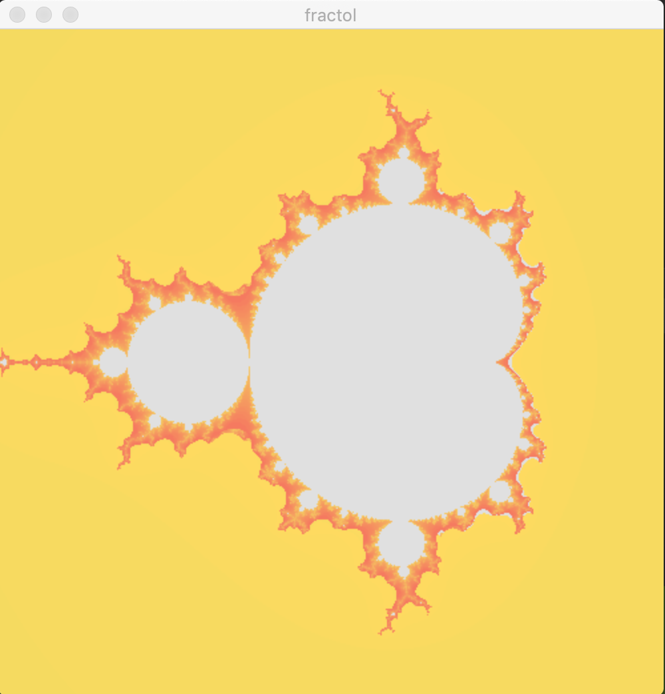
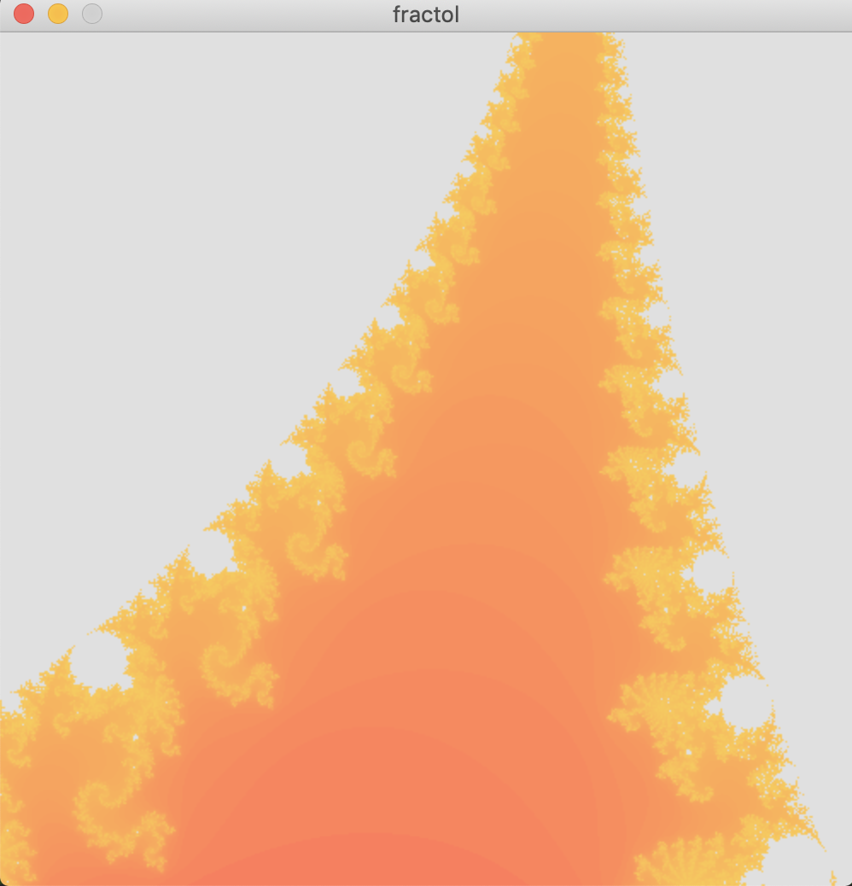
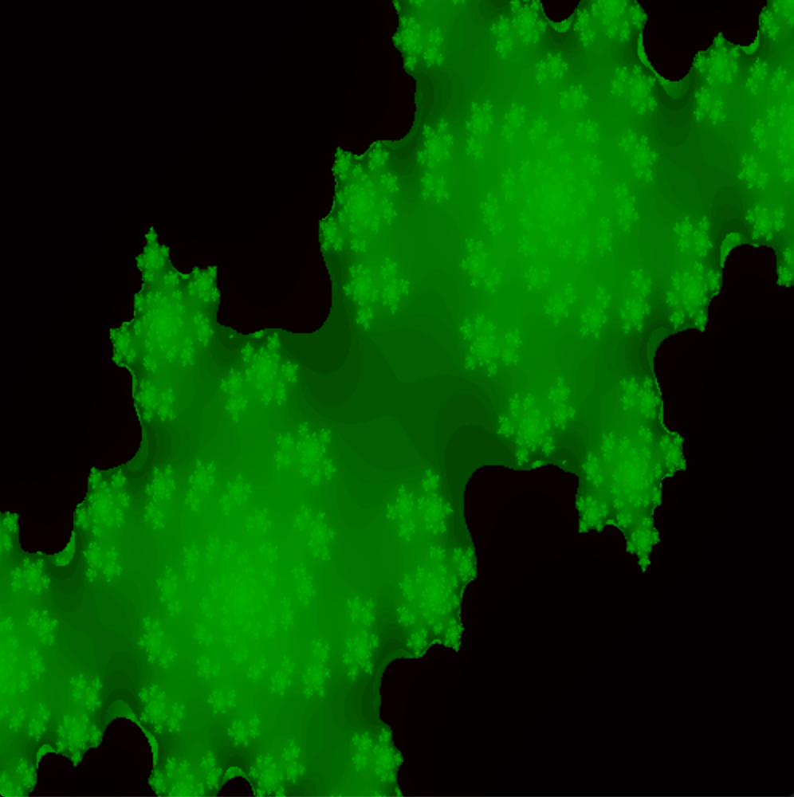
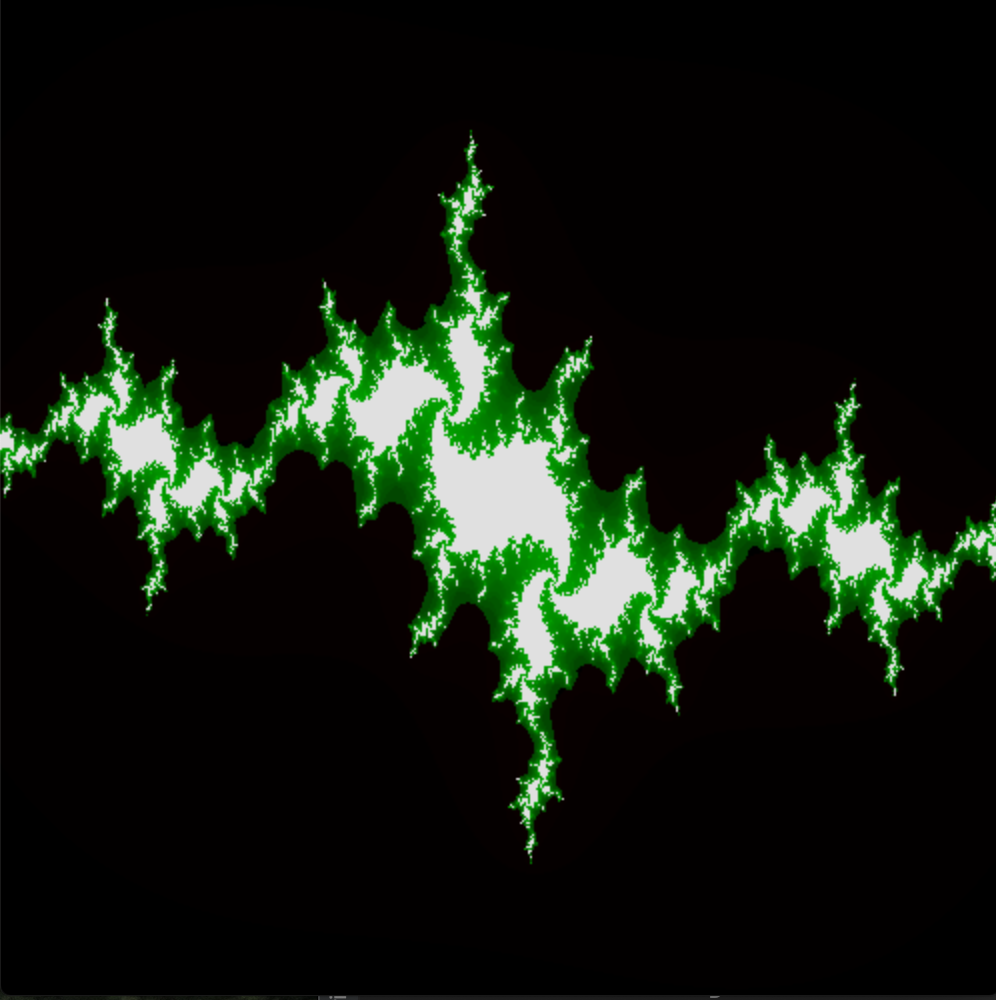
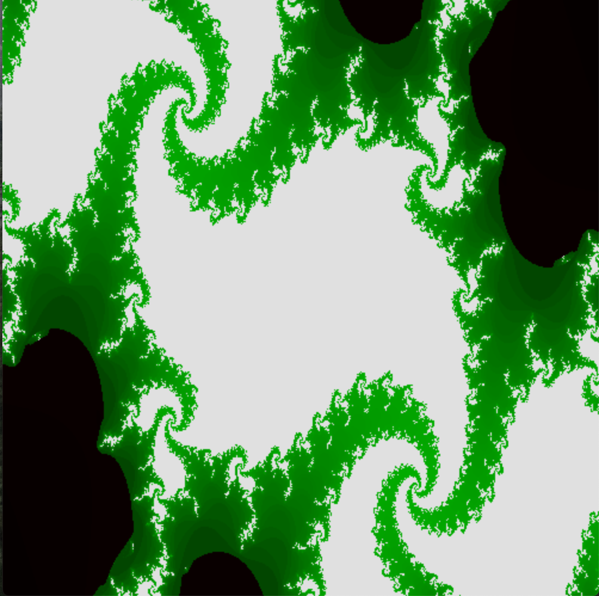
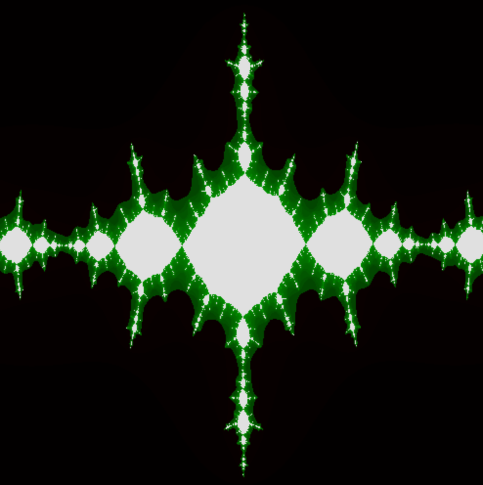
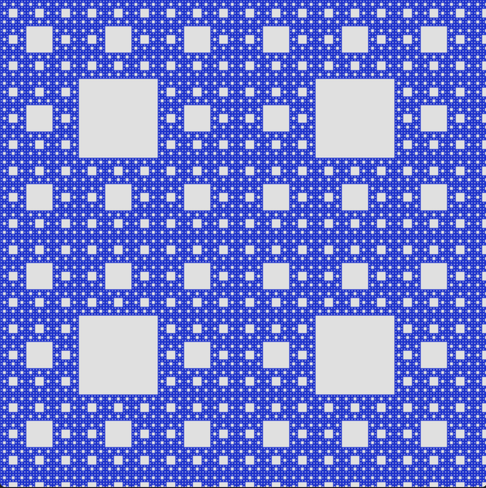
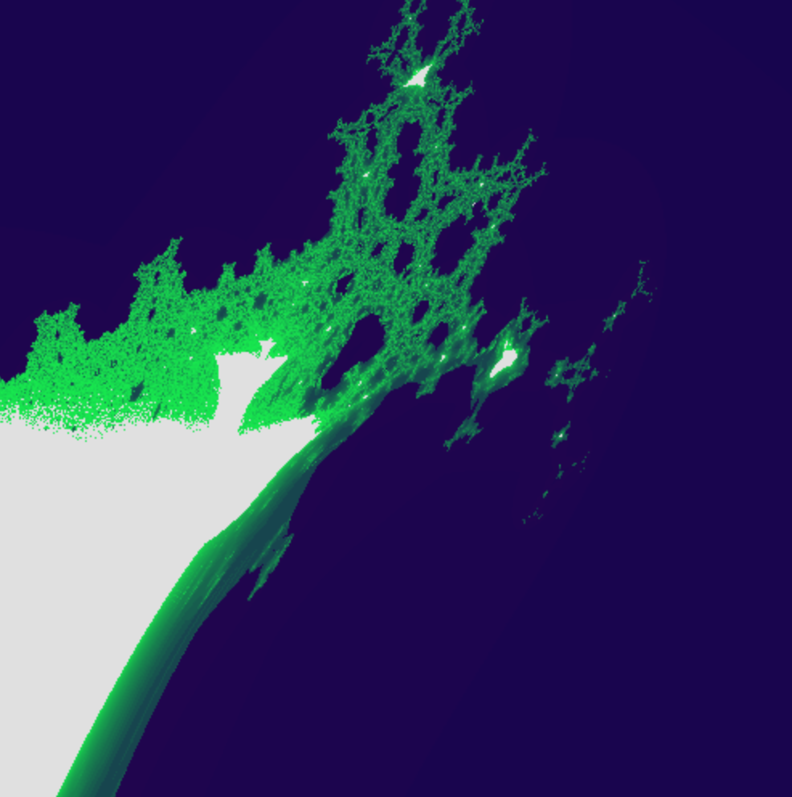
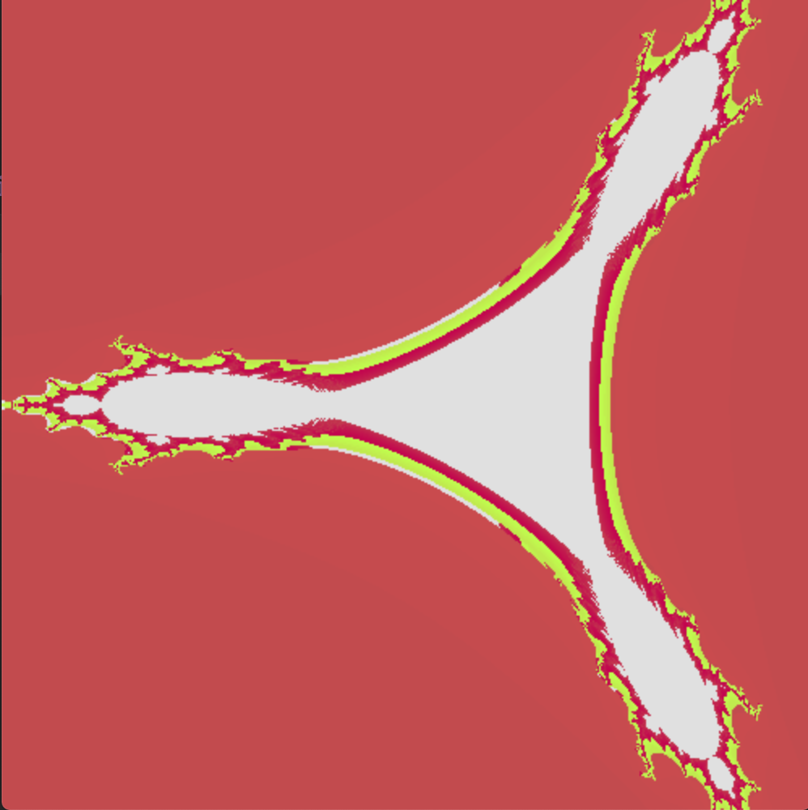

# Fract'ol

 Fractol is a most interesting project of 21 school. The purpose of this project is to create fractal graphics image.

 This project work macOS only.
 
 ## Fractal graphics
 
 Fractal - self-similar geometric figure. In mathematics fractal means set of point in Euclidean space.
 The most famos fractals: 
 ### Mandelbrot set:

 

### And Julia set:

 

## Instalation
 
 Clone repository and run following command:

```
 make
```
 After use the command, will be create file name "fractol".

## Run programm

 After creating file, you can run the project following command:

```
 ./fractol
```
 The program takes several parameters:
 1) First parameter - name of fractal which you will start.
 2) Second parameters only for Julia set.

 To start program with Mandelbrot set use this parameters:
 ```
 ./fractol mandelbrot
```

 List of first parameters:
 1)mandelbrot
 2)julia
 3)serpinskiy
 4)burningship
 5)triple
 
 List of second parameters for julia set
 1) 2
 2) 3

 Example Julia set with second parameter:
```
 ./fractol julia 2
```
## What I did implement

 1) You can move fractals use the buttons (W, A, S, D), like video game.
 2) You can zoom fractals, also like video game.
 3) You can change the RGB scheme. Use buttons (R, G, B).
 4) You can change all Julia's sets. Just move the mouse!
 5) For exit use ESC.

## Examples of fractals:
 
 Now I will show you result of my work.
 
### Mandelbrot





### Julia

 
 
 

 

 

### Serpinskiy Carpet

 
 
### Burning Ship

 
 
### Triple

 
 
## Author

Arnisfet (MRudge).